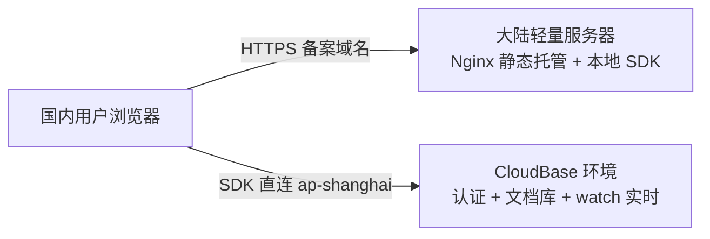

# 国内化部署完整指南

本文档是从零到上线的**全流程手册**：域名与备案、CloudBase 后端、大陆服务器初始化、Nginx/HTTPS、部署与联调。适用于将「工作时间记录器」从 GitHub Pages / Supabase 迁到**大陆备案服务器 + 腾讯云开发 CloudBase**。

> 相关文档：
> - CloudBase 控制台细项：[cloudbase/SETUP.md](../cloudbase/SETUP.md)
> - 数据模型：[cloudbase/schema.md](../cloudbase/schema.md)
> - 数据迁移：[DATA_MIGRATION.md](DATA_MIGRATION.md)
> - Nginx 配置模板：[deploy/nginx.conf](../deploy/nginx.conf)
> - 一键部署脚本：[deploy/deploy-mainland.sh](../deploy/deploy-mainland.sh)

---

## 0. 架构概览

迁移后，国内用户访问链路全部落在大陆，消除跨境延迟：



| 组件 | 职责 | 部署位置 |
|------|------|----------|
| 静态前端 | HTML/CSS/JS、PWA、自托管 `vendor/cloudbase.js` | 大陆轻量服务器（Nginx） |
| 身份认证 | 邮箱注册/登录、会话 | CloudBase Auth（上海） |
| 数据存储 | 工时记录、设置、进行中会话 | CloudBase 文档数据库 |
| 实时同步 | 跨设备「进行中计时」 | CloudBase `watch` |
| ICP 备案载体 | 域名必须备案才能对外提供 Web 服务 | 同一大陆轻量服务器 |

**关键约束**

- CloudBase **静态托管不能作为备案接入资源**，必须单独买大陆地域轻量服务器。
- 备案审核期间，域名**不能对外提供 Web 服务**（可先配 CloudBase、本地开发）。
- `config.js` 含环境 ID，**不随 rsync 上传**（见部署脚本），需在服务器单独维护。
- CloudBase 安全域名必须包含线上 `https://域名` 和本地 `localhost:8080`。

---

## 1. 全流程时间线

建议按以下顺序推进（备案可与 CloudBase 配置并行）：

| 阶段 | 内容 | 预计耗时 |
|------|------|----------|
| ① 采购 | 注册域名 + 购买大陆轻量服务器 | 当天 |
| ② 备案 | 提交 ICP 备案 | 7–20 个工作日 |
| ③ CloudBase | 建环境、认证、集合、安全规则 | 1–2 小时 |
| ④ 本地验证 | 本地静态服务 + 注册/登录/同步 | 1 小时 |
| ⑤ 服务器初始化 | SSH、Nginx、防火墙、目录 | 1–2 小时 |
| ⑥ 解析 + HTTPS | DNS A 记录、Certbot 证书 | 备案通过后 1 小时 |
| ⑦ 部署上线 | rsync 上传、权限修复、联调 | 30 分钟 |
| ⑧ 数据迁移 | 本地数据上传或 Supabase 导出 | 视数据量 |

---

## 2. 阶段一：域名与服务器采购

### 2.1 购买域名

1. 登录 [腾讯云域名注册](https://dnspod.cloud.tencent.com/)（或其他注册商）。
2. 选择 `.com` / `.cn` 等后缀，完成实名认证。
3. 记下域名，下文以 `your-domain.com` 为例（实际案例：`flytime.cloud`）。

### 2.2 购买大陆轻量应用服务器

路径：腾讯云控制台 → 轻量应用服务器 → 创建实例

| 项目 | 要求 |
|------|------|
| 地域 | **大陆节点**：北京 / 上海 / 广州 / 南京 / 成都等 |
| 时长 | 包年包月 **≥ 3 个月**（备案硬性要求） |
| 配置 | 2核2G 即可（仅静态托管 + 备案载体） |
| 镜像 | 推荐 **OpenCloudOS** 或 **CentOS**，自带 `yum`/`dnf` |
| 参考价格 | 新用户秒杀约 ¥38/年，常规约 ¥68/年 |

创建后记下：

- **公网 IP**（如 `1.2.3.4`）
- **root 密码** 或配置 **SSH 密钥**

### 2.3 本地 SSH 免密（推荐）

在**开发机**执行：

```bash
# 若尚无密钥
ssh-keygen -t ed25519 -C "deploy-work-time-recorder"

# 将公钥写入服务器（按提示输入 root 密码）
ssh-copy-id root@1.2.3.4

# 验证
ssh root@1.2.3.4 "hostname && uname -a"
```

后续 `deploy-mainland.sh` 依赖 SSH 免密或已配置的密钥代理。

---

## 3. 阶段二：ICP 备案

### 3.1 为什么必须备案

在中国大陆机房对外提供 Web 服务（含 Nginx 托管静态站），域名须完成 **ICP 备案**。未备案域名解析到大陆 IP 后，可能被运营商拦截或要求关停。

### 3.2 备案入口

[腾讯云备案系统](https://cloud.tencent.com/product/ba) → 开始备案

### 3.3 准备材料（个人备案）

| 材料 | 说明 |
|------|------|
| 身份证 | 正反面照片 |
| 手机号 | 本人实名，需短信核验 |
| 域名 | 已在注册商完成实名 |
| 备案服务器 | 选择刚购买的**大陆轻量服务器**（非 CloudBase） |
| 核验方式 | 腾讯云 App 人脸 / 幕布拍照等（按省份要求） |

### 3.4 填写要点

1. **主体信息**：个人姓名、证件号、地址、手机。
2. **网站信息**：
   - 网站名称：与应用相关、不含敏感词（如「个人工时记录」）。
   - 域名：填写 `your-domain.com`（不要带 `www` 除非同时备案）。
   - 服务内容：一般选「其他」或「生活服务业」等如实选项。
3. **接入商**：腾讯云（购买轻量服务器自动关联）。

### 3.5 备案期间限制

- 域名**不可对外提供 Web 服务**（不要提前解析并对外访问）。
- 可先完成：CloudBase 配置、本地开发、服务器装 Nginx（可用 IP 自测，勿用未备案域名对外）。
- 审核周期：**约 7–20 个工作日**（各省不同）。

### 3.6 备案通过后

1. 在备案系统查看 **备案号**（页脚展示用，可选）。
2. 进行 **DNS 解析**（见阶段六）。
3. 在 CloudBase → 安全配置 → **Web 安全域名** 加入 `your-domain.com`（不带协议）。

---

## 4. 阶段三：CloudBase 后端配置

在 [云开发控制台](https://console.cloud.tencent.com/tcb) 完成。详细清单见 [cloudbase/SETUP.md](../cloudbase/SETUP.md)。

### 4.1 创建环境

1. 点击「新建环境」。
2. **地域**：`上海（ap-shanghai）` — 与 `config.js` 中 `CLOUDBASE_REGION` 一致。
3. **套餐**：先用免费体验版（3000 点/月）；长期可升个人版。
4. 创建完成后复制 **环境 ID**（形如 `common-xxxxxxxx`）。

### 4.2 项目 config 配置

在**开发机**项目根目录：

```bash
cp config.example.js config.js
```

编辑 `config.js`：

```javascript
const APP_CONFIG = {
    CLOUDBASE_ENV: 'common-你的环境ID',  // 替换为真实环境 ID
    CLOUDBASE_REGION: 'ap-shanghai',
    // ...
};
```

> `config.js` 已在 `.gitignore` 逻辑中由部署脚本排除上传，**服务器上需单独创建同名文件**（见阶段八）。

### 4.3 身份认证（Auth v1）

路径：**环境 → 身份认证 → 登录方式**

| 能力 | 控制台操作 | 应用行为 |
|------|-----------|----------|
| 用户名密码登录 | 常规登录 → **开启** | 登录时邮箱填入 username |
| 邮箱验证码 | **开启** + 配置发信 | 注册时「获取验证码」 |

**发信配置（注册必需）**

路径：邮箱验证码 → 配置发信 → 推荐 **内置发信**（免 SMTP 配置）。

**注意**：本应用统一走 **Auth v1** API，不要在控制台混开 v2 导致行为不一致。

**用户流程**

- 注册：邮箱 + 密码（8–32 位，含字母和数字）→ 获取验证码 → 注册成功自动登录。
- 登录：邮箱 + 密码。

### 4.4 安全域名

路径：**环境 → 安全配置 → WEB 安全域名**

添加：

```
localhost:8080
your-domain.com
```

本地开发必须加端口；线上备案域名**不要**写 `https://` 前缀。

### 4.5 数据库集合

路径：**环境 → 数据库 → 集合管理 → 新建集合**

| 集合名 | 文档 ID 规则 | 用途 |
|--------|-------------|------|
| `work_records` | 记录 UUID | 工时记录 |
| `todos` | 待办 UUID | 按天待办 |
| `user_settings` | 用户 `uid` | 标签、主题、闹钟预设 |
| `active_sessions` | 用户 `uid` | 进行中计时（实时同步） |

字段结构见 [cloudbase/schema.md](../cloudbase/schema.md)。

### 4.6 安全规则（每个集合相同）

路径：集合 → 权限设置 → 自定义安全规则

```json
{
  "read": "doc._openid == auth.uid",
  "write": "doc._openid == auth.uid"
}
```

含义：用户只能读写 `_openid` 等于自己 `uid` 的文档（SDK 写入时自动注入 `_openid`）。

### 4.7 索引（work_records）

路径：集合 `work_records` → 索引管理 → 新建索引

| 索引字段 | 排序 | 用途 |
|----------|------|------|
| `_openid` | 升序 | 按用户过滤 |
| `updatedAt` | 升序 | 增量同步 |
| `_openid` + `startTime` | 升序 + **降序** | 按开始时间列表 |

若增量同步或排序报错，多半是缺少对应复合索引。

### 4.8 CloudBase 配置验收清单

- [ ] 环境 ID 已填入本地 `config.js`
- [ ] 用户名密码登录已开启
- [ ] 邮箱验证码 + 内置发信已配置
- [ ] 安全域名含 `localhost:8080` 与线上域名
- [ ] 三个集合已创建
- [ ] 三个集合安全规则已设置
- [ ] `work_records` 索引已建

---

## 5. 阶段四：本地开发与预验证

备案等待期间应完成本地联调，避免上线当天才发现 CloudBase 配置问题。

### 5.1 启动静态服务

在项目根目录：

```bash
python3 -m http.server 8080
```

浏览器访问：`http://localhost:8080`

> 不要用 `file://` 直接打开 `index.html`，Service Worker 与部分 API 会异常。

### 5.2 验证项

| 步骤 | 预期结果 |
|------|----------|
| 打开页面 | 无控制台报错，CloudBase SDK 从 `/vendor/cloudbase.js` 加载 |
| 注册新账号 | 收到验证码邮件，注册成功并自动登录 |
| 登录 | 邮箱+密码可登录 |
| 新建工时记录 | 记录出现，刷新后仍在 |
| 设置标签/主题 | 刷新后保留 |
| 两台设备登录同一账号 | 「进行中计时」可实时同步 |
| 离线后恢复网络 | 数据自动同步 |

### 5.3 数据迁移（可选）

若从 Supabase 迁数据，见 [DATA_MIGRATION.md](DATA_MIGRATION.md)。本地有完整数据时，登录后会静默同步到云端（本地∪云端）。

---

## 6. 阶段五：服务器初始化（首次 SSH 登录后）

以下在**服务器**上执行（备案前后均可，但对外域名须等备案通过）。

### 6.1 系统更新与基础工具

```bash
# OpenCloudOS / CentOS 系
sudo dnf update -y    # 或 yum update -y
sudo dnf install -y nginx rsync certbot python3-certbot-nginx
# 若 certbot 包名不同：sudo dnf install -y certbot
```

```bash
sudo systemctl enable nginx
sudo systemctl start nginx
sudo systemctl status nginx
```

### 6.2 防火墙放行 80/443

腾讯云轻量控制台 → 防火墙 / 安全组：

| 端口 | 协议 | 来源 | 说明 |
|------|------|------|------|
| 22 | TCP | 你的 IP 或 0.0.0.0/0 | SSH |
| 80 | TCP | 0.0.0.0/0 | HTTP（Certbot 验证 + 跳转 HTTPS） |
| 443 | TCP | 0.0.0.0/0 | HTTPS |

系统防火墙（若启用）：

```bash
sudo firewall-cmd --permanent --add-service=http
sudo firewall-cmd --permanent --add-service=https
sudo firewall-cmd --reload
```

### 6.3 创建网站目录

```bash
sudo mkdir -p /var/www/work-time-recorder
sudo chown -R nginx:nginx /var/www/work-time-recorder
sudo chmod 755 /var/www
```

### 6.4 禁用默认站点（避免与正式域名冲突）

```bash
# 若存在 default.conf 且监听 80
sudo mv /etc/nginx/conf.d/default.conf /etc/nginx/conf.d/default.conf.bak 2>/dev/null || true
sudo nginx -t && sudo systemctl reload nginx
```

### 6.5 确认 Nginx 主配置

`/etc/nginx/nginx.conf` **保持默认即可**，确认包含：

```nginx
include /etc/nginx/conf.d/*.conf;
```

站点配置放在 `/etc/nginx/conf.d/your-domain.com.conf`，**不要**直接改主配置。

---

## 7. 阶段六：域名解析（备案通过后）

在域名 DNS 控制台（腾讯云 DNSPod 等）添加记录：

| 记录类型 | 主机记录 | 记录值 | TTL |
|----------|----------|--------|-----|
| A | `@` | 轻量服务器公网 IP | 600 |
| A | `www`（可选） | 同上 | 600 |

验证解析生效：

```bash
dig +short your-domain.com
# 或
nslookup your-domain.com
```

应返回服务器公网 IP。

---

## 8. 阶段七：Nginx + HTTPS

### 8.1 复制并修改站点配置

在**开发机**将模板中的域名替换为实际域名，上传到服务器：

```bash
# 本地：复制模板并编辑 server_name、ssl 路径
scp deploy/nginx.conf root@1.2.3.4:/etc/nginx/conf.d/your-domain.com.conf
```

或 SSH 到服务器手动创建 `/etc/nginx/conf.d/your-domain.com.conf`，内容参考 [deploy/nginx.conf](../deploy/nginx.conf)：

**必须修改的项**

| 配置项 | 说明 |
|--------|------|
| `server_name` | 改为 `your-domain.com`（与证书、DNS 完全一致） |
| `root` | 保持 `/var/www/work-time-recorder` |
| `ssl_certificate` | Certbot 或腾讯云证书路径 |

**HTTP 跳转 HTTPS**（模板已含）：

```nginx
server {
    listen 80;
    server_name your-domain.com;
    return 301 https://$host$request_uri;
}
```

**缓存策略**（模板已含，勿删）：

- `/vendor/*`：长期缓存（第三方 SDK）
- 业务 `.js/.css`：`no-cache`，避免部署后浏览器仍用旧代码
- `/sw.js`：禁止缓存，保证 PWA 更新

### 8.2 申请 SSL 证书（Let's Encrypt）

**重要顺序**：须**先**有 `server_name your-domain.com` 的 Nginx 配置（可先只监听 80），再跑 Certbot。

```bash
# 仅 HTTP 阶段可先 reload nginx，再：
sudo certbot --nginx -d your-domain.com
```

按提示输入邮箱、同意条款。成功后证书位于：

```
/etc/letsencrypt/live/your-domain.com/fullchain.pem
/etc/letsencrypt/live/your-domain.com/privkey.pem
```

将 `nginx.conf` 中 SSL 路径改为上述路径，然后：

```bash
sudo nginx -t && sudo systemctl reload nginx
```

**自动续期**（certbot 默认装定时任务）：

```bash
sudo certbot renew --dry-run
```

### 8.3 备选：腾讯云免费 SSL 证书

1. 控制台 → SSL 证书 → 申请免费 DV 证书（域名验证）。
2. 下载 Nginx 格式，上传到服务器如 `/etc/nginx/ssl/`。
3. 在站点配置中改用：

```nginx
ssl_certificate     /etc/nginx/ssl/your-domain.com.pem;
ssl_certificate_key /etc/nginx/ssl/your-domain.com.key;
```

### 8.4 Nginx 1.26+ http2 警告

若 `nginx -t` 出现：

```
the "listen ... http2" directive is deprecated
```

将 `listen 443 ssl http2;` 改为：

```nginx
listen 443 ssl;
http2 on;
```

仅为警告，不影响运行；模板 [deploy/nginx.conf](../deploy/nginx.conf) 已采用新写法。

---

## 9. 阶段八：部署前端

### 9.1 服务器上创建 config.js

部署脚本**不会上传** `config.js`（避免覆盖、避免把开发机配置误提交）。首次部署需在服务器手动创建：

```bash
ssh root@1.2.3.4
sudo nano /var/www/work-time-recorder/config.js
```

内容与本地一致（填入同一 `CLOUDBASE_ENV`）。保存后：

```bash
sudo chown nginx:nginx /var/www/work-time-recorder/config.js
sudo chmod 644 /var/www/work-time-recorder/config.js
```

### 9.2 使用一键部署脚本（推荐）

在**开发机**项目根目录：

```bash
chmod +x deploy/deploy-mainland.sh
./deploy/deploy-mainland.sh root@1.2.3.4 your-domain.com
```

脚本会：

1. `rsync` 同步项目（排除 `.git`、`config.js` 等）
2. SSH 修复权限（`chown nginx:nginx`、`chmod`、SELinux `chcon`）

### 9.3 手动部署（等价命令）

```bash
rsync -avz --delete \
  --exclude '.git' \
  --exclude '.cursor' \
  --exclude 'node_modules' \
  --exclude 'config.js' \
  ./ root@1.2.3.4:/var/www/work-time-recorder/

ssh root@1.2.3.4 'chown -R nginx:nginx /var/www/work-time-recorder && chmod 755 /var/www'
```

### 9.4 验证静态资源

```bash
curl -I https://your-domain.com/
curl -I https://your-domain.com/index.html
curl -I https://your-domain.com/vendor/cloudbase.js
curl -I https://your-domain.com/sw.js
```

期望：`HTTP/2 200`（或 `HTTP/1.1 200`），且 **不是 403**。

---

## 10. 阶段九：线上联调验收

### 10.1 功能验收清单

- [ ] `https://your-domain.com` 可打开，无混合内容报错
- [ ] 注册 / 登录 / 登出正常
- [ ] 新建、编辑、删除工时记录可同步到 CloudBase
- [ ] 标签、主题、闹钟预设同步
- [ ] 手机 + 电脑同时登录，进行中计时可实时同步
- [ ] 离线记录工作后，联网自动上传
- [ ] PWA「添加到主屏幕」可用；更新代码后刷新能加载新版本（`sw.js` 不长期缓存）
- [ ] CloudBase 控制台 → 数据库能看到对应用户文档

### 10.2 浏览器开发者工具快速检查

| 面板 | 检查点 |
|------|--------|
| Network | `vendor/cloudbase.js`、`config.js` 均 200 |
| Console | 无 `CLOUDBASE_ENV`、跨域、认证相关报错 |
| Application → Service Workers | SW 已注册，更新后 activate |

### 10.3 CloudBase 控制台核对

登录云开发控制台，确认：

- 安全域名含线上域名
- 对应用户 `uid` 下 `work_records` 有数据
- `active_sessions` 在计时中有更新

---

## 11. 日常运维

### 11.1 更新前端代码

```bash
./deploy/deploy-mainland.sh root@1.2.3.4 your-domain.com
```

若修改了 `sw.js` 中 `CACHE_NAME` 版本号，用户下次访问会拉取新缓存。

### 11.2 修改 CloudBase 环境

若更换环境 ID，需同时改：

- 服务器 `/var/www/work-time-recorder/config.js`
- 本地开发 `config.js`

改完后无需重启 Nginx，刷新页面即可。

### 11.3 证书续期

Let's Encrypt 证书 90 天有效，certbot 会自动续期。可每月检查：

```bash
sudo certbot certificates
```

### 11.4 日志位置

| 日志 | 路径 |
|------|------|
| Nginx 访问 | `/var/log/nginx/access.log` |
| Nginx 错误 | `/var/log/nginx/error.log` |
| 系统 | `journalctl -u nginx` |

### 11.5 备份建议

- 应用数据在 CloudBase，可在控制台定期导出集合。
- 用户侧仍可用 App 内「导出 CSV」作个人备份。
- 服务器仅静态文件，可用 git tag + rsync 回滚；保留 `config.js` 副本。

---

## 12. 故障排查

### 12.1 Certbot：证书签发成功但无法安装到 Nginx

**现象**

```
Successfully received certificate.
Could not install certificate
Could not automatically find a matching server block for your-domain.com.
```

**原因**：`/etc/nginx/conf.d/` 中没有 `server_name your-domain.com` 的 server block。

**处理**

1. 先手动创建 `/etc/nginx/conf.d/your-domain.com.conf`（参考 `deploy/nginx.conf`）。
2. 证书路径改为：
   ```nginx
   ssl_certificate     /etc/letsencrypt/live/your-domain.com/fullchain.pem;
   ssl_certificate_key /etc/letsencrypt/live/your-domain.com/privkey.pem;
   ```
3. `sudo nginx -t && sudo systemctl reload nginx`
4. 可选：`sudo certbot install --cert-name your-domain.com`

**注意**：`server_name`、certbot `-d` 参数、DNS 解析域名必须**完全一致**（`flytime.cloud` ≠ `flytime.cloud.com`）。

### 12.2 HTTPS 返回 403 Forbidden

**现象**：`curl -I https://your-domain.com` → `HTTP/2 403`

SSL 和 Nginx 正常，但进程读不到文件。常见于 rsync 后属主为 `root`。

**一键修复**（SSH 登录服务器）：

```bash
sudo chown -R nginx:nginx /var/www/work-time-recorder
sudo chmod 755 /var/www
sudo find /var/www/work-time-recorder -type d -exec chmod 755 {} +
sudo find /var/www/work-time-recorder -type f -exec chmod 644 {} +
# OpenCloudOS / CentOS 若启用了 SELinux：
sudo chcon -R -t httpd_sys_content_t /var/www/work-time-recorder
```

或重新运行：`./deploy/deploy-mainland.sh root@服务器 your-domain.com`

**排查顺序**

```bash
ls -la /var/www/work-time-recorder/index.html
sudo tail -20 /var/log/nginx/error.log
getenforce   # Enforcing 时需 chcon
```

| 日志关键词 | 原因 | 处理 |
|-----------|------|------|
| `Permission denied` | 文件权限或 SELinux | chown/chmod/chcon |
| `directory index ... is forbidden` | 缺少 index.html | 重新部署 |
| `No such file or directory` | root 路径错误 | 检查 nginx `root` |

### 12.3 页面打开但无法登录 / 报跨域或安全域名错误

- CloudBase 控制台 → 安全域名是否含**线上域名**（无 `https://`）。
- 是否用备案域名访问（不要用 IP 直连测 CloudBase 功能）。
- 服务器 `config.js` 是否存在且 `CLOUDBASE_ENV` 正确。

### 12.4 注册收不到验证码

- 控制台 → 邮箱验证码 → 发信是否配置（推荐内置发信）。
- 检查垃圾邮件文件夹。
- 控制台发信额度是否用尽（免费版有限制）。

### 12.5 同步失败 / 增量拉取报错

- `work_records` 复合索引是否已建（见 4.7）。
- 安全规则是否为 `doc._openid == auth.uid`。
- 浏览器 Console 具体错误码，对照 [CloudBase 文档](https://cloud.tencent.com/document/product/876)。

### 12.6 部署后仍加载旧 JS

- 强制刷新：`Ctrl+Shift+R` / 清除站点数据。
- 确认 `sw.js` 中 `CACHE_NAME` 已 bump。
- Nginx 对业务 JS 已设 `no-cache`（模板已配置）。

### 12.7 `/etc/nginx/conf.d/` 为空是否正常？

正常。新装 Nginx 默认无站点，需自行创建 `your-domain.com.conf`。不要直接改 `/etc/nginx/nginx.conf`。

---

## 13. 费用参考（个人 / 年）

| 项目 | 费用 |
|------|------|
| 大陆轻量 2核2G | ¥38–68 |
| 域名 | ¥30–60 |
| ICP 备案 | ¥0 |
| CloudBase 免费体验版 | ¥0（3000 点/月，单人通常够） |
| CloudBase 个人版 | ¥239（19.9/月，40000 点/月） |
| **合计（免费版）** | **约 ¥70–130/年** |
| **合计（个人版）** | **约 ¥310–370/年** |

---

## 附录 A：首次部署命令速查（备案通过后）

```bash
# === 开发机 ===
# 1. 配置 CloudBase 与本地 config.js，本地 8080 验证通过
# 2. 部署
./deploy/deploy-mainland.sh root@YOUR_IP your-domain.com

# === 服务器（若尚未初始化）===
ssh root@YOUR_IP
sudo dnf install -y nginx rsync certbot python3-certbot-nginx
sudo mkdir -p /var/www/work-time-recorder
sudo mv /etc/nginx/conf.d/default.conf /etc/nginx/conf.d/default.conf.bak 2>/dev/null || true
# 上传 nginx 站点配置后：
sudo nginx -t && sudo systemctl enable --now nginx
sudo certbot --nginx -d your-domain.com
# 创建 config.js
sudo nano /var/www/work-time-recorder/config.js
sudo chown nginx:nginx /var/www/work-time-recorder/config.js

# === 验证 ===
curl -I https://your-domain.com/
```

## 附录 B：与旧架构的差异

| 项目 | 旧（GitHub Pages + Supabase） | 新（大陆服务器 + CloudBase） |
|------|------------------------------|------------------------------|
| 前端托管 | GitHub Pages / Vercel | 大陆 Nginx 静态托管 |
| SDK 加载 | jsDelivr CDN | 本地 `vendor/cloudbase.js` |
| 后端 | Supabase（跨境） | CloudBase 上海 |
| 认证 | Supabase Auth | CloudBase Auth v1 |
| 数据库 | PostgreSQL | 文档型集合 |
| 实时 | Supabase Realtime | CloudBase `watch` |
| 域名 | 无需备案 | **必须 ICP 备案** |

## 附录 C：相关文件索引

| 文件 | 作用 |
|------|------|
| `config.js` / `config.example.js` | CloudBase 环境 ID |
| `auth.js` | CloudBase 认证封装 |
| `sync-engine.js` | 数据库读写与 watch |
| `vendor/cloudbase.js` | 自托管 SDK（UMD） |
| `sw.js` | PWA 缓存策略 |
| `deploy/nginx.conf` | Nginx 站点模板 |
| `deploy/deploy-mainland.sh` | rsync + 权限修复 |

---

*文档版本：与 flytime.cloud 生产部署经验同步更新。*
